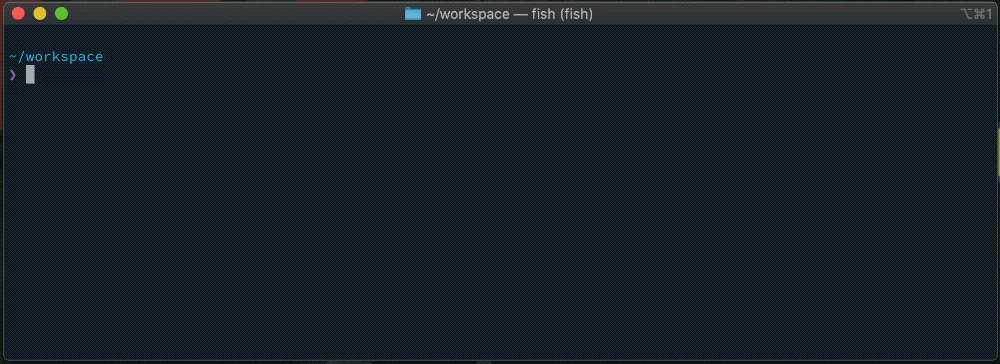

# git-workspace :rocket:
[](https://crates.io/crates/git-workspace)
[](https://github.com/orf/git-workspace/actions)



If your company has a large number of repositories and your work involves jumping between a lot of them then `git-workspace` can save you some time by:

* Easily synchronizing your projects directory with **Github**, **Gitlab.com** or **Gitlab self-hosted** :wrench:
* Keep projects consistently named and under the correct path :file_folder:
* Automatically set upstreams for forks :zap:
* Move deleted repositories to an archive directory :floppy_disk:
* Allowing you to access any repository instantly :shipit:
* Execute `git fetch` on all projects in parallel :godmode:

This may sound useless, but the "log into your git provider, browse to the project, copy the clone URL, devise a suitable path to clone it" dance can be a big slowdown. The only obvious solution here is to spend more time than you'll ever spend doing this in your whole life on writing a tool in Rust to do it for you.

Table of Contents
=================

   * [Install :cd:](#install-cd)
      * [Homebrew (MacOS   Linux)](#homebrew-macos--linux)
      * [Nix (MacOS   Linux)](#nix-macos--linux)
      * [Binaries (Windows)](#binaries-windows)
      * [Cargo](#cargo)
   * [Usage :saxophone:](#usage-saxophone)
      * [Define your workspace](#define-your-workspace)
      * [Provider credentials](#provider-credentials)
      * [Adding providers](#adding-providers)
      * [Updating your workspace](#updating-your-workspace)
      * [Fetching all changes](#fetching-all-changes)
   * [Switch projects :repeat:](#switch-projects-repeat)
      * [Fish, with fzf](#fish-with-fzf)
   * [Contributing :bug:](#contributing-bug)

# Install :cd:

## Homebrew (MacOS + Linux)

`brew tap orf/brew`, then `brew install git-workspace`

## Nix (MacOS + Linux)

### nix-shell
```bash
nix-shell -p git-workspace
```

### nix shell (Flakes)
```bash
nix shell nixpkgs#git-workspace
```

### home-manager (home.nix)

```nix
{
  home.packages = with pkgs; [
    git-workspace
  ];
}
```

### NixOS (configuration.nix)

```nix
{
  environment.systemPackages = with pkgs; [
    git-workspace
  ];
}
```

## Binaries (Windows)

Download the latest release from [the github releases page](https://github.com/orf/git-workspace/releases). Extract it 
and move it to a directory on your `PATH`.

## Cargo

Don't do this, it's pretty slow: `cargo install git-workspace`

# Usage :saxophone:

Git is really annoying and hijacks the `--help` flag for subcommands. **So to get help use `git-workspace --help`, not `git workspace --help`**.

```
$ git-workspace --help
git-workspace 0.7.0
Tom Forbes <tom@tomforb.es>
Manage and update personal and work git repos from multiple providers

USAGE:
    git-workspace --workspace <workspace> <SUBCOMMAND>

FLAGS:
    -h, --help       
            Prints help information

    -V, --version    
            Prints version information


OPTIONS:
    -w, --workspace <workspace>    
             [env: GIT_WORKSPACE=/Users/tom/PycharmProjects/]


SUBCOMMANDS:
    add                Add a provider to the configuration
    fetch              Fetch new commits for all repositories in the workspace
    help               Prints this message or the help of the given subcommand(s)
    list               List all repositories in the workspace
    run                Run a git command in all repositories
    switch-and-pull    Pull new commits on the primary branch for all repositories in the workspace
    update             Update the workspace, removing and adding any repositories as needed
```

## Define your workspace

A workspace is the directory that `git-workspace` will manage for you, filling it with projects cloned from your providers. To configure this just set a `GIT_WORKSPACE` environment variable that points to an empty directory. For example:

`export GIT_WORKSPACE=~/projects`

## Provider credentials

Both Github and Gitlab require personal access tokens to access their GraphQL endpoints. Create an access token here:

* Github: https://github.com/settings/tokens (Just the `repo` scope)

* Gitlab: https://gitlab.com/profile/personal_access_tokens (Just the `api` scope)

Export these tokens as `GITHUB_TOKEN` and `GITLAB_TOKEN` in your shell.

## Adding providers

You can use `git workspace add` to quickly add entries to your `workspace.toml`:

* Clone all github repositories for a user or org

   * `git workspace add github [USER OR ORG NAME]`

* Clone a namespace or user from Gitlab: 

   * `git workspace add gitlab gitlab-ce/gitlab-services`

* Clone from a self-hosted gitlab instance: 

   * `git workspace add gitlab my-company-group --url=https://internal-gitlab.company.com`
   
### Multiple configs

Git workspace will read from any `workspace*.toml` file under your `$GIT_WORKSPACE` directory.

## Updating your workspace

Running `git workspace update` will:

1. Fetch all repositories from your providers
2. Clone any new repositories that are not present locally
3. Move any deleted repositories to `$GIT_WORKSPACE/.archived/` for posterity

## Fetching all changes

`git workspace fetch` will run `git fetch` on all projects.

# Switch projects :repeat:

`git workspace list` will output the names of all your projects. You can integrate this with whatever tool you wish to provide a way to quickly search for and select repositories.

## Fish, with [fzf](https://github.com/junegunn/fzf)

The following fish shell snippet gives you a `open-project [search-string]` command you can use to search for and open projects. It combines the `git workspace list` command with `fzf`, and opens the project path with your `$EDITOR`:

```fish
# ~/.config/fish/functions/open-project.fish
function open-project -d "Open a project"
  set filter "$argv"
  set chosen_project (git workspace list | fzf -q "$filter")
  if string length -q -- $chosen_project
     $EDITOR $GIT_WORKSPACE/$chosen_project
     pushd $GIT_WORKSPACE/$chosen_project
  end
end
```

## Bash, with [fzf](https://github.com/junegunn/fzf)

Contributed by a user (@kreyren:github.com):

```bash
#!/bin/sh
# shellcheck shell=sh # Written to comply with IEEE Std 1003.1-2017 for standard POSIX environment

###! # WorkSPace (wsp)
###! Switches to specified git-workspace project directory
###! - Requires git and fzf
wsp() {
    # Check for required non-standard commands
    for command in ${FZF:-"fzf"} ${GIT:-"git"}; do
        ${COMMAND:-"command"} -v "$command" || { ${PRINTF:-"printf"} "FATAL: %s\\n" "Command '$command' is not executable"; ${EXIT:-"exit"} 127 ;}
    done
    
    # shellcheck disable=SC2086 # Harmless warning about missing double-quotes that are not expected to allow parsing multiple arguments
    wsp_path="${1:-"${GTT_WORKSPACE:-"$PWD"}/$(${GIT:-"git"} workspace list | ${FZF:-"fzf"} ${fzf_arg:-"-q"} "$@")"}" # Path to the git workspace directory
    
    # Change directory
    ${CD:-"cd"} "$wsp_path" || { printf "FATAL: %s\\n" "Unable to change directory to '$wsp_path'";}
}
```

Consider using [shfmt](https://github.com/patrickvane/shfmt) to optimize the file size.

# Contributing :bug:

This is my first 'proper' Rust project. If you're experienced with Rust you might puke at the code, but any feedback to help me improve would be greatly appreciated!

If you want to contribute then just go for it. `cargo install` should get you ready to go. Be warned: there are currently no tests :bomb:. I run integration tests with Github Actions, but that's about it. It's on my to-do list, I promise :tm:.
